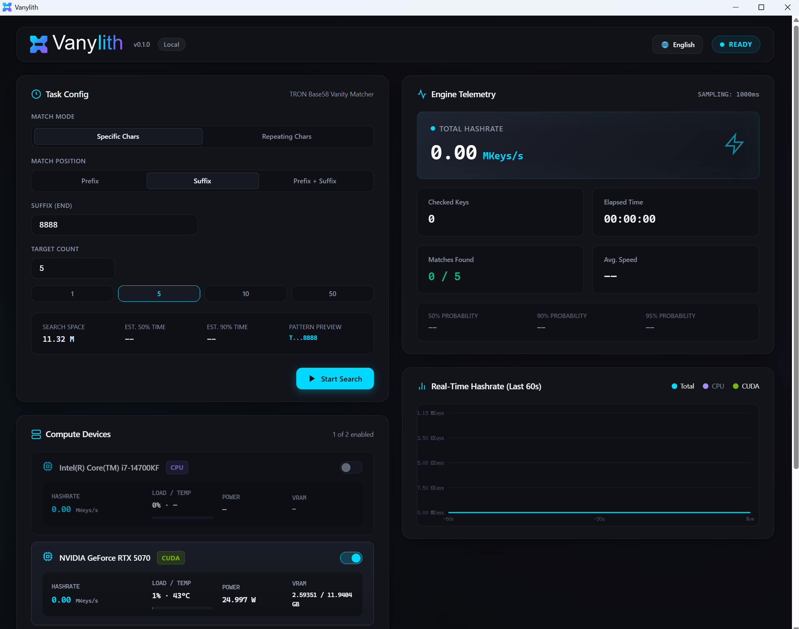

<p align="center">
  <picture>
    <source media="(prefers-color-scheme: dark)" srcset="assets/branding/vanylith-horizontal.svg">
    <source media="(prefers-color-scheme: light)" srcset="assets/branding/vanylith-horizontal-black.svg">
    
  </picture>
</p>

# Vanylith — GPU-Accelerated TRON Vanity Address Generator

<p align="center"><strong>Local and offline · CPU / NVIDIA CUDA · Private keys stay on your machine</strong></p>

<p align="center"><a href="README.md">简体中文</a> | <strong>English</strong> | <a href="README.ja.md">日本語</a></p>

Vanylith is a local TRON / TRX vanity address generator for Windows. It supports CPU search and NVIDIA CUDA GPU acceleration, prefix and suffix matching, repeated-character patterns, multi-device selection, and a WebView2 dashboard within a native Windows application.

Address generation, private-key generation, and result storage all take place locally. Vanylith has no telemetry by default and does not upload private keys.

## ✨ Features

| | Feature |
|---|---|
| ⚡ | NVIDIA CUDA GPU acceleration with CPU support |
| 🎯 | Prefix, suffix, and combined prefix + suffix matching |
| 🔁 | Repeated-character pattern matching |
| 🖥️ | Native Windows desktop app with a WebView2 dashboard |
| 🧩 | Multi-device selection across CPU and GPU |
| 🔐 | Every GPU candidate is independently verified on the CPU using `libsecp256k1` |
| 📴 | No telemetry by default and no private-key uploads |
| 📦 | Portable ZIP with no CUDA Toolkit installation required |

## ⚡ Hardware performance

| GPU | CUDA Target | Reference Performance | Validation |
|---|---:|---:|---|
| NVIDIA GeForce RTX 3090 | `sm_86` | ≈ 186 MKeys/s | **Tested** |
| NVIDIA GeForce RTX 4090 | `sm_89` | ≈ 277 MKeys/s | **Tested** |
| NVIDIA GeForce RTX 5070 | `sm_120` | ≈ 206 MKeys/s | **Tested** |

These figures are based on tests on real hardware and are provided for reference only. Actual performance may vary depending on driver version, temperature, power limits, background load, and pattern type.

## ✅ Correctness

v0.1.0 correctness tests: **37 / 37 passed, 0 failed**.

Coverage includes CPU / GPU address consistency; GPU candidate → CPU `libsecp256k1` verification; Literal and Repeat Prefix / Suffix / Both modes; curve-order boundaries; multi-device search; search-range allocation; Pause / Resume / Stop; task lifecycle; and CPU pattern re-checking.

## 📦 Download and quick start

1. Download `Vanylith-v0.1.0-win-x64.zip` from [GitHub Releases](https://github.com/ByNovaLin/vanylith/releases).
2. Extract it to a writable directory. The portable ZIP does not require an installer.
3. Double-click `Vanylith.exe`, choose a matching rule and one or more compute devices, then start the search.

> The v0.1.0 asset may not be published on the Releases page yet. Use the official release asset shown there when it becomes available.

## 🖼️ Interface Preview

<p align="center">
  <a href="docs/screenshots/en/main-running.png">
    
  </a>
</p>

<details>
<summary><strong>View idle screen</strong></summary>

<p align="center">
  <a href="docs/screenshots/en/main-idle.png">
    
  </a>
</p>

</details>

## 📁 Result storage

Each search creates a separate task directory under `results/task-*/` in the application directory. Generated TRON addresses and private keys are saved by default to:

```text
results/task-*/wallets.txt
```

`wallets.txt` is sensitive. If you lose a private key, it cannot be recovered. Back it up securely, never share it publicly, and do not commit `wallets.txt` or `results/` to a Git repository.

## 🎯 Matching rules

- **Prefix** matches immediately after TRON's fixed leading `T`.
- **Suffix** matches the end of the address.
- **Prefix + Suffix** applies both rules at once.
- **Repeat Pattern** matches any valid Base58 character repeated N times; prefix and suffix repeat characters do not need to be the same.
- Literal input accepts only the Base58 alphabet: `123456789ABCDEFGHJKLMNPQRSTUVWXYZabcdefghijkmnopqrstuvwxyz`.

Completion estimates are probabilistic, not guarantees. Longer patterns generally take longer to find.

## 🔐 Security design

- Private-key randomness is generated using Windows `BCryptGenRandom`, and private keys are accepted only when `1 <= key < secp256k1 curve order`.
- Before being saved, every GPU candidate is independently re-derived on the CPU using `libsecp256k1`, and its pattern is checked again.
- Private keys are never exposed through the Web API, SSE, or Dashboard JavaScript, nor are they written to standard application logs.
- By default, Vanylith does not use telemetry and does not upload private keys.

Memory clearing, host-system security, and user operational practices still have practical limitations. See [SECURITY.md](SECURITY.md) for the complete threat model and trust boundaries.

## 🖥️ System requirements and GPU status

To run Vanylith, you need:

- Windows 10 / 11 x64
- Microsoft Edge WebView2 Evergreen Runtime
- A compatible NVIDIA GPU and NVIDIA Driver for CUDA mode

Regular users do not need the CUDA Toolkit, `nvcc`, Visual Studio, CMake, Python, Node.js, or PHP.

The v0.1.0 CUDA fatbin includes native targets for `sm_80`, `sm_86`, `sm_89`, and `sm_120`, plus `compute_120` PTX. The RTX 3090, RTX 4090, and RTX 5070 have been validated on real hardware. The A100 / `sm_80` target is included but was not formally hardware-validated for v0.1.0.

<details open>
<summary><strong>📁 Project Structure</strong></summary>

<br>

```text
vanylith/
├─ src/                              # Core Vanylith source code
│  ├─ backend/                       # CPU and CUDA search backends
│  ├─ controller/                    # Task lifecycle and result persistence
│  ├─ core/                          # Cryptography, pattern matching, and search space
│  ├─ desktop/                       # Windows and WebView2 desktop shell
│  ├─ gpu/                           # NVML-based GPU monitoring
│  ├─ web/                           # Local API and embedded web resources
│  └─ main.cpp                       # Application entry point
│
├─ tests/                            # Reproducible correctness and core-feature tests
├─ scripts/                          # Public build, validation, and release helper scripts
│
├─ assets/
│  └─ branding/                      # Official Vanylith branding assets
│
├─ docs/
│  ├─ screenshots/                   # Chinese, English, and Japanese UI screenshots
│  ├─ CUDA_PERFORMANCE.md            # CUDA performance and validation documentation
│  ├─ PORTABLE_CUDA.md               # Portable CUDA build documentation
│  └─ third-party/                   # Third-party license materials
│
├─ .github/                          # GitHub PR and contribution configuration
│
├─ CMakeLists.txt                    # Main CMake build configuration
├─ CMakePresets.json                 # Standard build presets
├─ tronvanity_dashboard.html         # Embedded desktop interface source
│
├─ README.md                         # Simplified Chinese documentation
├─ README.en.md                      # English documentation
├─ README.ja.md                      # Japanese documentation
├─ README.txt                        # Portable distribution documentation
│
├─ LICENSE                           # VCSL 1.0
├─ NOTICE                            # Project copyright and notices
├─ THIRD_PARTY_NOTICES.md            # Third-party license notices
├─ CONTRIBUTING.md                   # Contribution guidelines
├─ CONTRIBUTOR_LICENSE_AGREEMENT.md  # VCLA 1.0
├─ SECURITY.md                       # Security design and vulnerability reporting
└─ .gitignore                        # Build-output and local-sensitive-file exclusions
```

Build artifacts, runtime logs, wallet results, and local development files are not included in the source repository.

</details>

<details open>
<summary><strong>🛠️ Build from source</strong></summary>

### Build dependencies

- Visual Studio 2022 Build Tools with the C++ workload
- CMake 3.24+
- Git
- CUDA Toolkit 13.3 for CUDA builds

Use the repository's Release preset. With CUDA Toolkit 13.3 detected, the current CMake configuration automatically enables the CUDA backend and production fatbin targets:

```powershell
cmake --preset windows-x64-release
cmake --build --preset release --parallel
ctest --preset release
```

The first configuration step fetches a pinned version of `bitcoin-core/libsecp256k1`. These dependencies are for developers and are not required to run the portable ZIP.

</details>

## 📜 License

Vanylith is licensed under the **Vanylith Community Source License 1.0 (VCSL 1.0)**. It is a Community Source / Source Available license and **is not an OSI-approved Open Source license**.

VCSL 1.0 permits personal use, research, security audits, internal organizational use, internal commercial use, internal closed-source modifications, and free public forks subject to VCSL 1.0. Public modified versions must be free, publish their Corresponding Source, remain under VCSL 1.0, preserve notices, and be marked as unofficial forks.

Without separate written permission, resale, paid distribution, paid SaaS, paid APIs or bots, generation-for-hire, commercial hosted vanity generation, and misuse of official marks are prohibited.

This is a non-authoritative plain-language summary. If it conflicts with [LICENSE](LICENSE), the license controls. Third-party components retain their own licenses; for example, `libsecp256k1` is MIT-licensed. See [THIRD_PARTY_NOTICES.md](THIRD_PARTY_NOTICES.md).

## 🤝 Contributing

Issues and contributions are welcome. Please read [CONTRIBUTING.md](CONTRIBUTING.md) and the [Vanylith Contributor License Agreement 1.0](CONTRIBUTOR_LICENSE_AGREEMENT.md) first. Public Project Steward identity: [`@ByNovaLin`](https://github.com/ByNovaLin).

## 🗺️ Roadmap

Post-v0.1.0 priorities are CUDA Phase 2, broader NVIDIA hardware validation, UI / UX improvements, and more vanity matching rules.

Ethereum, Bitcoin, Solana, Linux, and macOS support may be considered in the future. No release dates are currently scheduled.
