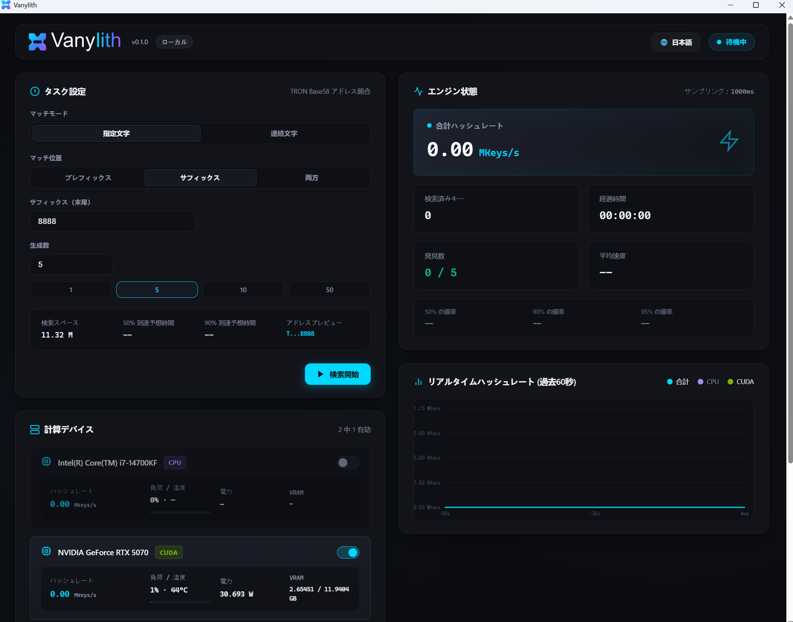

<p align="center">
  <picture>
    <source media="(prefers-color-scheme: dark)" srcset="assets/branding/vanylith-horizontal.svg">
    <source media="(prefers-color-scheme: light)" srcset="assets/branding/vanylith-horizontal-black.svg">
    
  </picture>
</p>

# Vanylith — GPU 加速対応の TRON バニティアドレス生成ツール

<p align="center"><strong>ローカルでオフライン動作 · CPU / NVIDIA CUDA 対応 · 秘密鍵はローカルにのみ保存</strong></p>

<p align="center"><a href="README.md">简体中文</a> | <a href="README.en.md">English</a> | <strong>日本語</strong></p>

Vanylith は Windows 向けのローカル TRON / TRX バニティアドレス生成ツールです。

CPU 検索と NVIDIA CUDA GPU アクセラレーションに対応し、プレフィックス / サフィックスの指定、連続文字パターン、複数デバイスの選択をサポートします。操作画面には、Windows ネイティブアプリ内で動作する WebView2 ダッシュボードを採用しています。

アドレス生成、秘密鍵生成、結果の保存はすべてローカルで行われます。デフォルトではテレメトリを使用せず、秘密鍵をアップロードすることもありません。

## ✨ 主な機能

| | 機能 |
|---|---|
| ⚡ | NVIDIA CUDA GPU アクセラレーションに対応し、CPU 検索も利用可能 |
| 🎯 | プレフィックス、サフィックス、プレフィックス + サフィックスの組み合わせ検索 |
| 🔁 | 連続文字パターンの照合 |
| 🖥️ | WebView2 ダッシュボードを備えた Windows ネイティブデスクトップアプリ |
| 🧩 | 複数の計算デバイスを選択可能 |
| 🔐 | すべての GPU 候補を CPU 上の `libsecp256k1` で個別に再検証 |
| 📴 | デフォルトでテレメトリなし、秘密鍵のアップロードなし |
| 📦 | CUDA Toolkit のインストールが不要なポータブル ZIP |

## ⚡ 実機パフォーマンス

| GPU | CUDA ターゲット | 参考性能 | 検証状況 |
|---|---:|---:|---|
| NVIDIA GeForce RTX 3090 | `sm_86` | ≈ 186 MKeys/s | **検証済み** |
| NVIDIA GeForce RTX 4090 | `sm_89` | ≈ 277 MKeys/s | **検証済み** |
| NVIDIA GeForce RTX 5070 | `sm_120` | ≈ 206 MKeys/s | **検証済み** |

上記は実機テストに基づく参考値です。実際の性能は、ドライバー、温度、電力制限、バックグラウンド負荷、マッチングルールの種類によって変動します。

## ✅ 正確性

v0.1.0 の正確性テスト結果：**37 / 37 passed、0 failed**。

テスト範囲には、CPU / GPU のアドレス一致、CPU 上の `libsecp256k1` による GPU 候補の再検証、指定文字 / 連続文字のプレフィックス・サフィックス・両方モード、楕円曲線の位数境界、複数デバイス検索、検索範囲の割り当て、一時停止 / 再開 / 停止、タスクライフサイクル、CPU によるパターン再確認が含まれます。

## 📦 ダウンロードとクイックスタート

1. [GitHub Releases](https://github.com/ByNovaLin/vanylith/releases) から `Vanylith-v0.1.0-win-x64.zip` をダウンロードします。
2. 書き込み可能なフォルダーへ展開します。ポータブル ZIP のため、インストーラーは不要です。
3. `Vanylith.exe` をダブルクリックし、マッチングルールと使用する計算デバイスを選択して検索を開始します。

> Releases ページには v0.1.0 のアセットがまだ公開されていない場合があります。公開後は、同ページに掲載された正式版アセットを使用してください。

## 🖼️ インターフェース

<p align="center">
  <a href="docs/screenshots/ja/main-running.png">
    
  </a>
</p>

<details>
<summary><strong>待機画面を見る</strong></summary>

<p align="center">
  <a href="docs/screenshots/ja/main-idle.png">
    
  </a>
</p>

</details>

## 📁 結果の保存先

検索ごとに、アプリケーションディレクトリ内の `results/task-*/` に個別のタスクディレクトリが作成されます。生成した TRON アドレスと秘密鍵は、デフォルトで次のファイルに保存されます。

```text
results/task-*/wallets.txt
```

`wallets.txt` は機密ファイルです。秘密鍵を紛失すると復元できません。安全な方法でバックアップし、公開しないでください。`wallets.txt` や `results/` を Git リポジトリへコミットしないでください。

## 🎯 マッチングルール

- **プレフィックス**：TRON アドレス先頭の固定文字 `T` の直後から照合します。
- **サフィックス**：アドレス末尾を照合します。
- **プレフィックス + サフィックス**：両方の条件を同時に適用します。
- **連続文字**：有効な Base58 文字のいずれかが N 回連続するパターンを照合します。プレフィックスとサフィックスで同じ文字を使う必要はありません。
- 指定文字には Base58 文字セット `123456789ABCDEFGHJKLMNPQRSTUVWXYZabcdefghijkmnopqrstuvwxyz` のみ使用できます。

所要時間の推定値は確率に基づくものであり、保証ではありません。一般に、条件が長いほど検索に時間がかかります。

## 🔐 セキュリティ設計

- Windows の `BCryptGenRandom` で乱数を生成し、`1 <= key < secp256k1 curve order` を満たす秘密鍵だけを使用します。
- GPU 候補は保存前に CPU 上の `libsecp256k1` でアドレスを個別に再導出し、パターンを再確認します。
- 秘密鍵は Web API、SSE、ダッシュボードの JavaScript には送信されず、通常ログにも記録されません。
- デフォルトではテレメトリを使用せず、秘密鍵をアップロードしません。

ただし、メモリ消去の確実性、ホスト環境の安全性、ユーザー側の運用には実用上の限界があります。脅威モデルと信頼境界の詳細は [SECURITY.md](SECURITY.md) を参照してください。

## 🖥️ 動作要件と GPU 対応状況

Vanylith の実行には次の環境が必要です。

- Windows 10 / 11 x64
- Microsoft Edge WebView2 Evergreen Runtime
- CUDA モードでは、互換性のある NVIDIA GPU と NVIDIA ドライバー

通常の利用者が CUDA Toolkit、`nvcc`、Visual Studio、CMake、Python、Node.js、PHP をインストールする必要はありません。

v0.1.0 の CUDA fatbin には、`sm_80`、`sm_86`、`sm_89`、`sm_120` のネイティブターゲットと `compute_120` PTX が含まれます。RTX 3090、RTX 4090、RTX 5070 は実機で検証済みです。A100 / `sm_80` 向けターゲットは含まれていますが、v0.1.0 では A100 実機による正式な検証を行っていません。

<details open>
<summary><strong>📁 プロジェクト構成</strong></summary>

<br>

```text
vanylith/
├─ src/                              # Vanylith のコアソースコード
│  ├─ backend/                       # CPU / CUDA 検索バックエンド
│  ├─ controller/                    # タスク管理と結果の保存
│  ├─ core/                          # 暗号処理、パターン照合、探索空間
│  ├─ desktop/                       # Windows / WebView2 デスクトップシェル
│  ├─ gpu/                           # NVML ベースの GPU モニタリング
│  ├─ web/                           # ローカル API と組み込み Web リソース
│  └─ main.cpp                       # アプリケーションのエントリーポイント
│
├─ tests/                            # 正確性と主要機能を検証する再現可能な自動テスト
├─ scripts/                          # 公開するビルド・検証・リリース補助スクリプト
│
├─ assets/
│  └─ branding/                      # Vanylith 公式ブランドアセット
│
├─ docs/
│  ├─ screenshots/                   # 中国語 / 英語 / 日本語 UI スクリーンショット
│  ├─ CUDA_PERFORMANCE.md            # CUDA パフォーマンス / 検証ドキュメント
│  ├─ PORTABLE_CUDA.md               # Portable CUDA ビルドドキュメント
│  └─ third-party/                   # サードパーティライセンス資料
│
├─ .github/                          # GitHub PR / Contribution 設定
│
├─ CMakeLists.txt                    # CMake メインビルド設定
├─ CMakePresets.json                 # 標準ビルドプリセット
├─ tronvanity_dashboard.html         # 組み込みデスクトップ UI のソース
│
├─ README.md                         # 簡体字中国語ドキュメント
├─ README.en.md                      # English
├─ README.ja.md                      # 日本語ドキュメント
├─ README.txt                        # Portable 配布パッケージの説明
│
├─ LICENSE                           # VCSL 1.0
├─ NOTICE                            # プロジェクトの著作権 / Notice
├─ THIRD_PARTY_NOTICES.md            # サードパーティライセンス通知
├─ CONTRIBUTING.md                   # Contribution ガイドライン
├─ CONTRIBUTOR_LICENSE_AGREEMENT.md  # VCLA 1.0
├─ SECURITY.md                       # セキュリティ設計 / 脆弱性報告
└─ .gitignore                        # ビルド生成物 / ローカル機密ファイルの除外設定
```

ビルド生成物、実行ログ、ウォレット結果、ローカル開発用ファイルはソースリポジトリには含まれません。

</details>

<details open>
<summary><strong>🛠️ ソースからビルド</strong></summary>

### ビルド要件

- C++ ワークロードを含む Visual Studio 2022 Build Tools
- CMake 3.24+
- Git
- CUDA ビルドには CUDA Toolkit 13.3

リポジトリの Release プリセットを使用します。CUDA Toolkit 13.3 が検出されると、現在の CMake 設定により CUDA バックエンドとリリース用 fatbin ターゲットが自動的に有効になります。

```powershell
cmake --preset windows-x64-release
cmake --build --preset release --parallel
ctest --preset release
```

初回の構成時に、固定バージョンの `bitcoin-core/libsecp256k1` を取得します。これらは開発者向けの依存関係であり、ポータブル ZIP の実行には必要ありません。

</details>

## 📜 ライセンス

Vanylith は **Vanylith Community Source License 1.0（VCSL 1.0）** の下で提供されます。Community Source / Source Available ライセンスであり、**OSI が承認した Open Source ライセンスではありません**。

VCSL 1.0 では、個人利用、研究、セキュリティ監査、組織内利用、社内での商用利用、非公開の社内改変、および VCSL 1.0 に従う無料の公開 fork が認められています。公開する改変版は無料で提供し、Corresponding Source を公開し、VCSL 1.0 を継続して適用し、LICENSE / NOTICE などの通知を保持したうえで、非公式 fork であることを明示する必要があります。

別途書面による許可がない限り、再販売、有料配布、有料 SaaS、有料 API / Bot、generation-for-hire、商用ホスティング型バニティ生成サービス、公式マークの不正使用は禁止されています。

上記は理解を助けるための非公式な概要です。[LICENSE](LICENSE) と矛盾する場合は LICENSE が優先されます。`libsecp256k1` の MIT License など、サードパーティ製コンポーネントにはそれぞれのライセンスが適用されます。詳細は [THIRD_PARTY_NOTICES.md](THIRD_PARTY_NOTICES.md) を参照してください。

## 🤝 コントリビューション

Issue の報告やコントリビューションを歓迎します。事前に [CONTRIBUTING.md](CONTRIBUTING.md) と [Vanylith Contributor License Agreement 1.0](CONTRIBUTOR_LICENSE_AGREEMENT.md) を確認してください。Public Project Steward identity: [`@ByNovaLin`](https://github.com/ByNovaLin)。

## 🗺️ ロードマップ

v0.1.0 以降は、CUDA Phase 2、より広範な NVIDIA 実機検証、UI / UX の改善、バニティアドレスのマッチングルール拡充を優先する予定です。

Ethereum、Bitcoin、Solana、Linux、macOS への対応は、将来の候補として検討しています。具体的なリリース時期は未定です。
