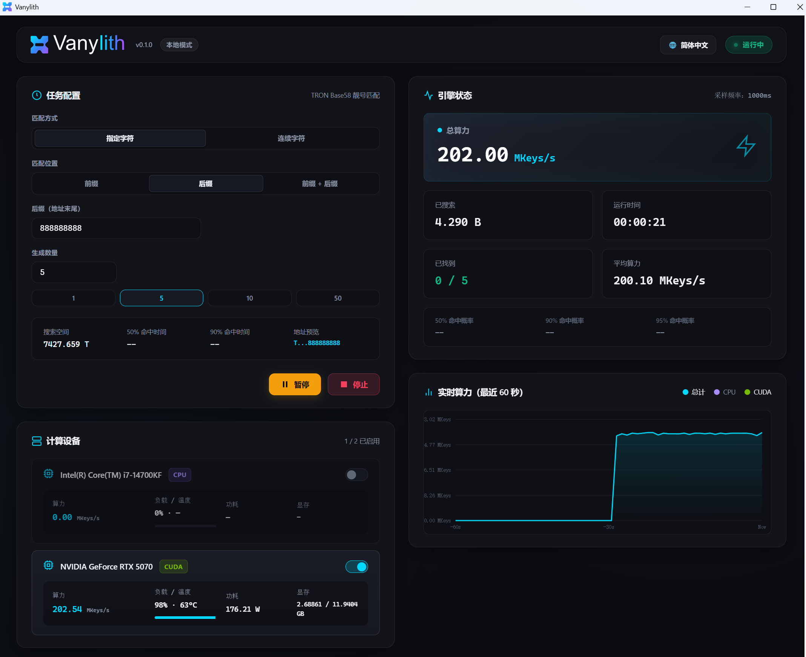
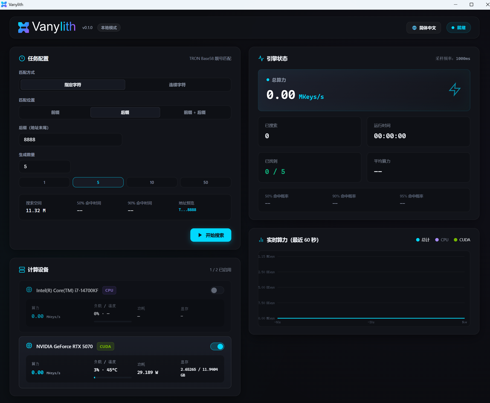

<p align="center">
  <picture>
    <source media="(prefers-color-scheme: dark)" srcset="assets/branding/vanylith-horizontal.svg">
    <source media="(prefers-color-scheme: light)" srcset="assets/branding/vanylith-horizontal-black.svg">
    
  </picture>
</p>

# Vanylith — GPU 加速的 TRON 靓号地址生成器

<p align="center"><strong>本地离线运行 · CPU / NVIDIA CUDA · 私钥仅保存在本机</strong></p>

<p align="center"><strong>简体中文</strong> | <a href="README.en.md">English</a> | <a href="README.ja.md">日本語</a></p>

Vanylith 是一个面向 Windows 的本地 TRON / TRX 靓号地址生成器。它支持 CPU 与 NVIDIA CUDA GPU、前缀与后缀组合、重复字符规则、多设备选择，以及 Windows 原生窗口中的 WebView2 Dashboard。

地址生成、私钥生成与结果保存均在本机完成。Vanylith 默认不使用遥测，也不会上传私钥。

## ✨ 主要特性

| | 功能 |
|---|---|
| ⚡ | NVIDIA CUDA GPU 加速，同时支持 CPU |
| 🎯 | 前缀、后缀及前后缀组合匹配 |
| 🔁 | Repeat 重复字符匹配 |
| 🖥️ | Windows 原生窗口 + WebView2 Dashboard |
| 🧩 | CPU / GPU 多设备选择 |
| 🔐 | GPU Candidate 必须经过 CPU `libsecp256k1` 独立复核 |
| 📴 | 默认无 Telemetry、无私钥上传 |
| 📦 | Portable ZIP，无需安装 CUDA Toolkit |

## ⚡ 真机性能

| GPU | CUDA Target | 参考性能 | 验证状态 |
|---|---:|---:|---|
| NVIDIA GeForce RTX 3090 | `sm_86` | ≈ 186 MKeys/s | **已测试** |
| NVIDIA GeForce RTX 4090 | `sm_89` | ≈ 277 MKeys/s | **已测试** |
| NVIDIA GeForce RTX 5070 | `sm_120` | ≈ 206 MKeys/s | **已测试** |

以上数据来自真实硬件测试，仅用于性能参考。实际性能会受到驱动版本、温度、功耗限制、后台负载和匹配规则类型等因素影响。

## ✅ 正确性

v0.1.0 正确性测试结果：**37 / 37 passed，0 failed**。

测试覆盖 CPU / GPU 地址一致性、GPU Candidate → CPU `libsecp256k1` 复核、Literal 与 Repeat 的 Prefix / Suffix / Both、曲线阶边界、多设备搜索、搜索区间分配、Pause / Resume / Stop、任务生命周期及 CPU Pattern 二次检查。

## 📦 下载与快速使用

1. 前往 [GitHub Releases](https://github.com/ByNovaLin/vanylith/releases) 下载 `Vanylith-v0.1.0-win-x64.zip`。
2. 解压到可写目录。Portable ZIP 无需安装程序。
3. 双击 `Vanylith.exe`，选择匹配规则和计算设备，然后开始搜索。

> Releases 页面可能尚未发布 v0.1.0；请以页面上的正式版本资产为准。

## 🖼️ 界面预览

<p align="center">
  <a href="docs/screenshots/zh-CN/main-running.png">
    
  </a>
</p>

<details>
<summary><strong>查看待机界面</strong></summary>

<p align="center">
  <a href="docs/screenshots/zh-CN/main-idle.png">
    
  </a>
</p>

</details>

## 📁 结果保存位置

每次任务都会在程序目录的 `results/task-*/` 下创建独立任务目录。生成的 TRON 地址和 Private Key 默认写入：

```text
results/task-*/wallets.txt
```

`wallets.txt` 是敏感文件。Private Key 丢失后无法恢复，请及时做好安全备份，不要公开分享，也不要将 `wallets.txt` 或 `results/` 提交到 Git 仓库。

## 🎯 匹配规则

- **Prefix**：匹配固定开头 `T` 之后的字符。
- **Suffix**：匹配地址末尾字符。
- **Prefix + Suffix**：同时匹配前缀和后缀。
- **Repeat Pattern**：匹配任意一个有效 Base58 字符连续重复 N 次；前缀与后缀的重复字符无需相同。
- Literal 输入仅接受 Base58 字符：`123456789ABCDEFGHJKLMNPQRSTUVWXYZabcdefghijkmnopqrstuvwxyz`。

命中时间是概率估计，并非完成时间保证；规则越长，平均搜索时间通常越久。

## 🔐 安全设计

- 使用 Windows `BCryptGenRandom` 生成随机数，并只接受 `1 <= key < secp256k1 curve order` 的私钥。
- GPU Candidate 保存前必须由 CPU `libsecp256k1` 独立派生地址并重新检查匹配规则。
- Private Key 不进入 Web API、SSE、Dashboard JavaScript 或普通日志。
- 默认无 Telemetry，不上传私钥。

内存清理、系统环境和用户操作仍有现实边界。完整威胁模型与安全边界请参阅 [SECURITY.md](SECURITY.md)。

## 🖥️ 系统要求与 GPU 状态

运行 Vanylith 需要：

- Windows 10 / 11 x64
- Microsoft Edge WebView2 Evergreen Runtime
- CUDA 模式需要兼容的 NVIDIA GPU 与 NVIDIA Driver

普通用户不需要 CUDA Toolkit、`nvcc`、Visual Studio、CMake、Python、Node.js 或 PHP。

v0.1.0 CUDA fatbin 包含 `sm_80`、`sm_86`、`sm_89`、`sm_120` 原生目标及 `compute_120` PTX。RTX 3090、RTX 4090 与 RTX 5070 已完成真机验证。A100 / `sm_80` 目标已包含，但 v0.1.0 尚未在 A100 真机上完成正式验证。

<details open>
<summary><strong>📁 项目结构</strong></summary>

<br>

```text
vanylith/
├─ src/                              # Vanylith 核心源码
│  ├─ backend/                       # CPU / CUDA 搜索后端
│  ├─ controller/                    # 任务管理与结果保存
│  ├─ core/                          # 密码学、匹配规则与搜索空间
│  ├─ desktop/                       # Windows / WebView2 桌面外壳
│  ├─ gpu/                           # 基于 NVML 的 GPU 状态监控
│  ├─ web/                           # 本地 API 与嵌入式 Web 资源
│  └─ main.cpp                       # 应用程序入口
│
├─ tests/                            # Correctness 与核心功能可复现自动化测试
├─ scripts/                          # 公开的构建、验证与发布辅助脚本
│
├─ assets/
│  └─ branding/                      # Vanylith 官方 Logo / Icon
│
├─ docs/
│  ├─ screenshots/                   # 中 / 英 / 日界面截图
│  ├─ CUDA_PERFORMANCE.md            # CUDA 性能与验证说明
│  ├─ PORTABLE_CUDA.md               # Portable CUDA 构建说明
│  └─ third-party/                   # 第三方许可证材料
│
├─ .github/                          # GitHub PR / Contribution 配置
│
├─ CMakeLists.txt                    # CMake 主构建配置
├─ CMakePresets.json                 # 标准构建预设
├─ tronvanity_dashboard.html         # 嵌入式桌面界面源码
│
├─ README.md                         # 简体中文说明
├─ README.en.md                      # English
├─ README.ja.md                      # 日本語
├─ README.txt                        # Portable 发行包说明
│
├─ LICENSE                           # VCSL 1.0
├─ NOTICE                            # 项目版权与 Notice
├─ THIRD_PARTY_NOTICES.md            # 第三方许可证说明
├─ CONTRIBUTING.md                   # Contribution 规则
├─ CONTRIBUTOR_LICENSE_AGREEMENT.md  # VCLA 1.0
├─ SECURITY.md                       # 安全设计与漏洞报告
└─ .gitignore                        # 构建产物与本地敏感文件排除规则
```

构建产物、运行日志、钱包结果及本地开发文件不会包含在源码仓库中。

</details>

<details open>
<summary><strong>🛠️ 从源码构建</strong></summary>

### 构建依赖

- Visual Studio 2022 Build Tools（C++ workload）
- CMake 3.24+
- Git
- CUDA 构建需要 CUDA Toolkit 13.3

使用仓库中的 Release preset；检测到 CUDA Toolkit 13.3 时，当前 CMake 配置会自动启用 CUDA 后端及正式 fatbin targets：

```powershell
cmake --preset windows-x64-release
cmake --build --preset release --parallel
ctest --preset release
```

首次配置会获取固定版本的 `bitcoin-core/libsecp256k1`。构建依赖仅面向开发者，不是运行 Portable ZIP 的前置条件。

</details>

## 📜 License

Vanylith 使用 **Vanylith Community Source License 1.0（VCSL 1.0）**。它是 Community Source / Source Available 许可证，**不是 OSI 批准的 Open Source 许可证**。

VCSL 1.0 允许个人使用、研究、安全审计、组织内部使用、内部商业使用、内部闭源修改，以及遵守 VCSL 1.0 的免费公开 fork。公开修改版本必须免费提供、公开 Corresponding Source、继续使用 VCSL 1.0、保留通知，并明确标记为非官方 fork。

未经单独书面授权，不得转售、付费分发、提供付费 SaaS、付费 API / Bot、generation-for-hire、商业托管靓号生成服务，或滥用官方标识。

以上仅为便于理解的非权威摘要。如摘要与许可证正文冲突，以 [LICENSE](LICENSE) 为准。第三方组件（例如 MIT 许可的 `libsecp256k1`）适用各自许可证；详见 [THIRD_PARTY_NOTICES.md](THIRD_PARTY_NOTICES.md)。

## 🤝 Contributing

欢迎提交问题与贡献。请先阅读 [CONTRIBUTING.md](CONTRIBUTING.md) 和 [Vanylith Contributor License Agreement 1.0](CONTRIBUTOR_LICENSE_AGREEMENT.md)。Public Project Steward identity：[`@ByNovaLin`](https://github.com/ByNovaLin)。

## 🗺️ Roadmap

v0.1.0 之后计划优先推进 CUDA Phase 2、更广泛的 NVIDIA 真机验证、UI / UX 改进，以及更多靓号匹配规则。

Ethereum、Bitcoin、Solana、Linux 与 macOS 支持属于未来可能考虑的方向，尚无确定发布时间。
